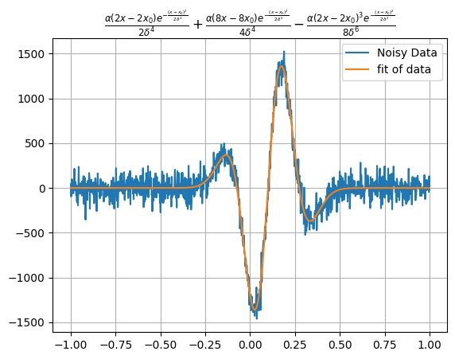

# univariate_tools
Tools to fit, interpolate, and synthesize univariate data.

# Installation 
## Method 1 - Directly from Github
```shell
pip install git+https://github.com/sandersa-nist/univariate_tools.git
```
## Method 2 - Clone then Install
1. Use your favorite way to clone the repo or download the zip file and extract it.  
2. pip install to that location (note pip expects a unix style string 'C:/univariate_tools/')

```shell
pip install <path to top folder>
```
# use case
Have you ever wanted to fit a really weird function of one variable? How about make a complicated synthetic time-domain signal? Have calibration data on an irregular grid and you need to interpolate? Then univariate_tools is for you!
FunctionalModel is a blend of [sympy](https://www.sympy.org/en/index.html) and [numpy](https://numpy.org/doc/stable/) functionality that lets the user do all kinds of math with functions and then fit data. 
```python
from univariate_tools import *
# lets make a composite function
line=FunctionalModel(parameters=["m","b"],variables="x",equation="m*x+b")
gaussian=FunctionalModel(parameters="alpha x0 delta",variables="x",equation="alpha*exp(-1*(x-x0)^2/(2*delta**2))")
gauss_line=line+gaussian
x_data=np.linspace(-1,1,1000)
plt.plot(x_data,gauss_line(alpha=1,x0=.1,delta=.1,m=1.2,b=.1,x=x_data))
plt.title("${0}$".format(gauss_line.to_latex()))
```

# [Example](./examples/Example.ipynb)
